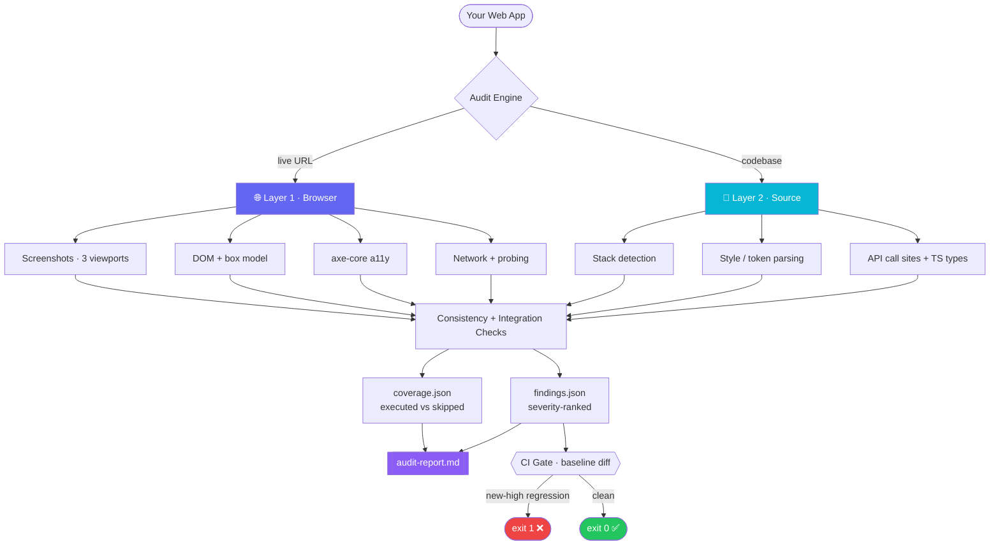

<!-- ╔══════════════════════════════════════════════════════════════════╗ -->
<!-- ║                        UI AUDIT PRO                                ║ -->
<!-- ╚══════════════════════════════════════════════════════════════════╝ -->

<div align="center">


<br/>

<a href="https://github.com/Pranjal-Upadhyay/ui-audit-pro">
  
</a>

<br/><br/>

<!-- Badges -->


<br/>

**A two-layer audit engine that detects visual inconsistencies, AI design slop, and frontend↔backend integration bugs — and tells you the truth about what it *couldn't* check.**

<br/>

[**Quick Start**](#-quick-start) &nbsp;•&nbsp; [**Features**](#-what-makes-it-different) &nbsp;•&nbsp; [**Architecture**](#-architecture) &nbsp;•&nbsp; [**Checks**](#-what-it-checks) &nbsp;•&nbsp; [**CI Gate**](#-ci-gate--baseline-diffing) &nbsp;•&nbsp; [**Usage**](#-usage)

</div>

---

## 🎯 What Is This?

**UI Audit Pro** runs **37 automated checks** — **24 UI/UX consistency categories** (including AI design tropes &amp; brand originality) and **13 frontend-to-backend integration checks** — across any web application.

<table>
<tr>
<td width="50%" valign="top">

### 🌐 Layer 1 — Browser-Level
Runs against a **live URL** via Playwright. Framework-agnostic. Captures:
- 📸 Screenshots at **3 viewports** (375 / 768 / 1440)
- 🧬 DOM snapshots + **real** computed box model
- ♿ **axe-core** accessibility (~90 WCAG rules)
- 🌊 Network traffic with **secret-redacted** bodies
- 🔁 **Active endpoint probing** (flaky / schema-variance)

</td>
<td width="50%" valign="top">

### 📂 Layer 2 — Source-Level
Reads your **codebase** with pluggable framework adapters. Pinpoints the **exact file &amp; line**:
- 🔎 Auto-detects your stack
- 🎨 Parses inline React styles, Tailwind, CSS modules
- 🔗 Traces API call sites &amp; TypeScript contracts
- 🗺️ Maps routes, components, and data flow
- 🧩 Falls back gracefully when a layer is missing

</td>
</tr>
</table>

---

## ✨ What Makes It Different

> **It never lies about coverage.** Most audit tools report "✅ All clear" whether they ran 5 checks or 50. UI Audit Pro tracks exactly which checks *executed* vs *were skipped*, and **grades an incomplete run `UNKNOWN`, never `EXCELLENT`.**

| | Capability | Why it matters |
|---|---|---|
| 🕵️ | **Honest coverage reporting** | Every report ships an *Audit Coverage* section (executed vs skipped). Zero findings + incomplete coverage ≠ a pass. |
| ♿ | **axe-core accessibility** | Real Deque axe-core engine — ~90 WCAG 2.0/2.1 A/AA rules with true impact levels, precise selectors &amp; help URLs (not 3 hand-rolled heuristics). |
| 🚦 | **Coverage-aware CI gate** | Baseline diffing with exit codes. A finding that vanished only because its check was *skipped* is flagged **UNVERIFIED**, never "resolved" — a coverage drop can't hide a regression. |
| 📐 | **Real layout integrity** | Overflow, clipping, off-viewport elements &amp; **&lt;44px touch targets** measured from the actual rendered box model. |
| 📱 | **Multi-viewport regression** | Captures 3 breakpoints and flags issues that appear *only* at narrow widths. |
| 🔁 | **Live endpoint probing** | Re-hits safe (GET/HEAD) endpoints to surface **intermittent 5xx flakiness** and **schema variance** a single request would miss. |
| 🔐 | **Secret-safe capture** | Response bodies are written to disk with `token`/`secret`/`password`/`authorization`/`api_key` fields redacted, and JSON shapes inferred with bounded depth. |
| 🤖 | **AI-slop detection** | Flags uncustomized AI-starter output: default palettes, font monoculture, LLM clichés, decorative-emoji overuse, lorem/placeholder content, interchangeable CTAs, glassmorphism &amp; signature gradients. |

---

## 🏗️ Architecture



---

## 🧰 Supported Frameworks

| Layer | Frameworks |
|-------|-----------|
| **Frontend** | Next.js · React · Vue.js · Vanilla HTML/CSS/JS |
| **Backend** | Node.js / Express |
| **Any** | Works with just a live URL — no source code required |

---

## 🔬 What It Checks

<details>
<summary><b>🎨 UI/UX Consistency &amp; Originality — 24 categories</b> (click to expand)</summary>

<br/>

**Brand &amp; AI Tropes (Category 24)** — detects "AI slop":
- Uncustomized indigo-500 / slate palettes (`#6366f1`)
- Inter / Geist font monoculture
- LLM marketing clichés ("supercharge your workflow", "seamless integration", …)
- Decorative-emoji overuse (✨🚀🔥) and excessive em-dashes (`—`)
- Placeholder / lorem content shipped to production
- Interchangeable generic CTAs ("Get Started" / "Learn More")
- Radial blur glow blobs (`blur-3xl`), glassmorphism, cliché gradients &amp; "Powered by AI" pill badges

**Visual &amp; Layout (Categories 1–23):**
Visual identity · spacing rhythm (4/8px grid) · typography scale · icon consistency · interaction states (real `:hover`/`:focus`) · modal behavior · loading/empty/error states · form validation · microcopy · navigation · responsive breakpoints · **axe-core accessibility** · animation · **layout integrity (overflow, clipping, touch targets)** · truncation · color semantics · grammar · pagination · notifications · role-based UI · dark mode · input affordance · print/PDF views.

</details>

<details>
<summary><b>🔗 Frontend ↔ Backend Integration — 13 checks</b> (click to expand)</summary>

<br/>

API contract / schema drift · type mismatches · state wiring · unhandled promise rejections · race conditions · optimistic UI correctness · auth/session handling · latency/timeout behavior · pagination data consistency · websocket sync · file upload/download edge cases · double-submit / idempotency · timezone mismatches.

Powered by **response-body capture** (secret-redacted) and **active endpoint probing** that surfaces flaky endpoints and schema variance across repeated requests.

</details>

---

## 🚦 CI Gate · Baseline Diffing

Turn a one-shot audit into a repeatable gate. Save a run as the baseline, then fail CI on regressions — **coverage-aware**, so a dropped check can never masquerade as a fixed issue.

```bash
# 1️⃣  Establish a baseline
python3 scripts/audit.py full --codebase ./app --url http://localhost:3000 --output ./baseline

# 2️⃣  Gate a fresh run against it (inline)
python3 scripts/audit.py full --codebase ./app --url http://localhost:3000 \
  --output ./current --baseline ./baseline --fail-on new-high

# …or gate an existing output dir without re-running
python3 scripts/audit.py baseline --output ./current --baseline ./baseline --fail-on new-high
```

| `--fail-on` | Gate fails when… |
|-------------|------------------|
| `none` | never (report only) |
| `new` | any new finding appears |
| `new-high` | a new **high/critical** finding appears · **(default)** |
| `regressed` | a new high/critical **or** an existing finding got worse |
| `any` | any new finding **or** severity regression |

> 🔎 **Coverage-aware guarantee:** a baseline finding that's absent this run is only counted **resolved** if its check actually re-ran. If the check was skipped, it's reported **UNVERIFIED** — and the run flags `COVERAGE REGRESSED`. Exit code `1` fails the build.

---

## ⚡ Quick Start

### Prerequisites
- Python **3.10+**
- Playwright (for browser-level checks)

```bash
pip install -r requirements.txt
playwright install chromium
```

### Install into your AI coding assistant

<details open>
<summary><b>Option 1 — Installer CLI (recommended)</b></summary>

```bash
git clone https://github.com/Pranjal-Upadhyay/ui-audit-pro.git
cd ui-audit-pro

python3 scripts/install.py --platform claude-code    # Claude Code
python3 scripts/install.py --platform codex          # OpenAI Codex
python3 scripts/install.py --platform cursor         # Cursor
python3 scripts/install.py --platform gemini-cli     # Gemini CLI
python3 scripts/install.py --platform kiro           # Kiro
python3 scripts/install.py --platform copilot        # GitHub Copilot

python3 scripts/install.py --all                     # all detected platforms
python3 scripts/install.py --platform claude-code --global   # user-level
python3 scripts/install.py --detect                  # show installed platforms
python3 scripts/install.py --platform claude-code --dry-run  # preview
```

</details>

<details>
<summary><b>Option 2 — Skills CLI</b></summary>

```bash
npx skills add Pranjal-Upadhyay/ui-audit-pro --skill ui-audit-pro --yes
```

</details>

<details>
<summary><b>Option 3 — Manual copy</b></summary>

```bash
# Claude Code
cp -r . ~/.claude/skills/ui-audit-pro/

# Codex / Cursor / Gemini CLI / Kiro
cp -r . .agents/skills/ui-audit-pro/

# GitHub Copilot → copy SKILL.md into:
#   .github/instructions/ui-audit-pro.instructions.md
```

</details>

<details>
<summary><b>Platform directory reference</b></summary>

<br/>

| Platform | Project-Level | User-Level (`--global`) |
|----------|--------------|--------------------------|
| Claude Code | `.claude/skills/ui-audit-pro/` | `~/.claude/skills/ui-audit-pro/` |
| Codex | `.agents/skills/ui-audit-pro/` | `~/.agents/skills/ui-audit-pro/` |
| Cursor | `.cursor/skills/ui-audit-pro/` | `~/.cursor/skills/ui-audit-pro/` |
| Gemini CLI | `.gemini/skills/ui-audit-pro/` | `~/.gemini/skills/ui-audit-pro/` |
| Kiro | `.kiro/skills/ui-audit-pro/` | `~/.kiro/skills/ui-audit-pro/` |
| Copilot | `.github/instructions/ui-audit-pro.instructions.md` | `~/.copilot/instructions/ui-audit-pro.instructions.md` |

</details>

---

## 🖥️ Usage

### As a CLI tool

```bash
# Auto-detect the stack
python3 scripts/audit.py detect --codebase ./app

# Full pipeline
python3 scripts/audit.py full --codebase ./app --url http://localhost:3000 --output ./audit-output

# Individual phases
python3 scripts/audit.py discover --codebase ./app --output ./audit-output
python3 scripts/audit.py capture  --codebase ./app --url http://localhost:3000 --output ./audit-output
python3 scripts/audit.py audit    --codebase ./app --url http://localhost:3000 --output ./audit-output
python3 scripts/audit.py report   --findings ./audit-output/findings.json --output ./audit-output
```

### Three operating modes

| Mode | Command | What runs |
|------|---------|-----------|
| 🌐 **Live-only** | `--url <url>` (no `--codebase`) | Layer 1 — full UI audit, no source |
| 📂 **Code-only** | `--codebase <path>` (no `--url`) | Layer 2 — adapter-based source analysis |
| 🔀 **Combined** | `--codebase <path> --url <url>` | Both — finds issues **and** pinpoints source |

### Inside your AI assistant

Once installed, just ask:

```text
Audit this codebase for UI/UX consistency issues
Run a full integration audit against http://localhost:3000
Gate this PR against our saved accessibility baseline
```

The assistant loads `SKILL.md`, detects your stack, runs the right checks, and produces a severity-ranked report with evidence.

---

## 📦 Output

```text
audit-output/
├── discovery.json      # Routes, API calls, components found
├── capture.json        # Screenshots, DOM snapshots, network logs
├── coverage.json       # ✅ executed vs ⏭️ skipped checks + capabilities
├── findings.json       # All issues with severity + evidence (baseline-diff input)
├── audit-report.md     # Final human-readable report
└── dom_snapshots/      # Per-route, per-viewport DOM + a11y + layout data
```

**Report sections:** Executive Summary · **Audit Coverage** (executed/skipped) · Findings by Severity · Cross-Cutting Patterns · **Report Diff** (coverage-aware) · Appendix.

---

## 🛟 Graceful Degradation

Degradation is always **reported, never silent**.

| Scenario | Behavior |
|----------|----------|
| `--url` given but Playwright missing | **Hard error, exit 2** — no misleading report |
| Live URL only (no source) | Layer 1 runs; Layer 2 checks marked **SKIPPED** with reason |
| Source only (no URL) | Layer 2 runs; Layer 1 checks marked **SKIPPED** with reason |
| Unknown framework | `static-html` adapter fallback |
| No TypeScript | Type-contract checks skipped gracefully |
| axe-core can't inject | Falls back to built-in a11y heuristics; `a11y_engine` records which ran |

---

## 🗂️ Project Structure

```text
ui-audit-pro/
├── SKILL.md                          # AI skill definition
├── README.md
├── pyproject.toml · requirements.txt
├── references/
│   ├── consistency-categories.md
│   └── backend-integration-checks.md
└── scripts/
    ├── audit.py                      # Main two-layer orchestrator
    ├── baseline_diff.py              # Coverage-aware CI-gate diff engine
    ├── install.py                    # Platform installer CLI
    ├── detect_stack.py               # Auto-detects framework
    ├── report_generator.py           # Report + coverage-aware diff section
    ├── adapters/                     # nextjs · react · vue · static_html · node_express
    ├── analyzers/                    # consistency · integration · style · component · api
    └── capture/                      # screenshot · network · dom_extractor
        └── vendor/axe.min.js         # Vendored axe-core (Deque, MPL-2.0)
```

---

## 🤝 Contributing

PRs welcome! Run the test suite before submitting:

```bash
pip install -e .
pytest tests/ -q      # 74 tests
```

---

## 📄 License

**MIT.** Bundles [axe-core](https://github.com/dequelabs/axe-core) (Deque Systems, MPL-2.0).

<div align="center">


<sub>Built for honest audits — because "no findings" should mean "we actually looked."</sub>

</div>
